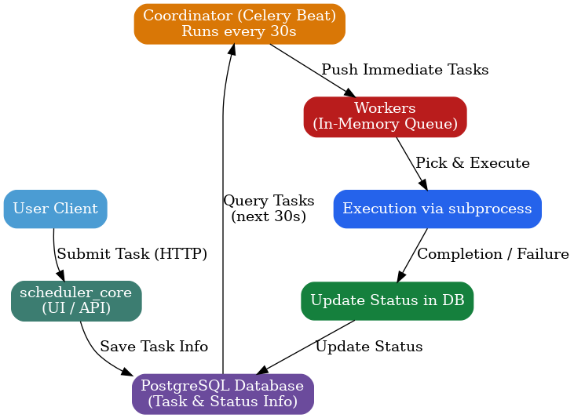

# **Django Scheduler System**

A **scalable, dockerized task scheduler** built with **Django, Celery, PostgreSQL, and Redis**.
This system efficiently schedules and executes tasks at precise times without overloading worker queues by leveraging a **short-window, push-based scheduling approach**.

---

## **Features**

* Task scheduling and execution through an HTTP API.
* Configurable schedules and task types.
* **Short-window scheduling** – only tasks due in the next 30 seconds are pushed to workers.
* Scalable execution with Celery workers.
* Dockerized for consistent deployment.

---

## **Architecture Components**

### **1. scheduler\_core (UI / API)**

* Accepts tasks from users via HTTP requests.
* Stores task details (command, schedule time, metadata) in PostgreSQL.
* Provides endpoints to check task status.

### **2. PostgreSQL Database**

* Stores:

  * Task ID
  * Command to execute
  * Scheduling information
  * Completion status and retry info

### **3. Coordinator**

* Runs every 30 seconds via **Celery Beat**.
* Queries the database for tasks scheduled in the next 30 seconds.
* Pushes only immediate tasks to workers.
* Retries failed tasks in the next cycle.

### **4. Workers**

* Maintain an in-memory queue of assigned tasks.
* Execute tasks using Python’s `subprocess` module.
* Update task completion status in the database.

---

## **Benefits**

1. **Queue Efficiency** – Prevents long-term backlog by only queuing imminent tasks.
2. **Better Resource Utilization** – Workers only handle short-term tasks, saving memory.
3. **Low Latency** – Faster execution since the queue remains small.
4. **Scalable** – Add more workers without changing scheduling logic.
5. **Fault Tolerance** – Failed tasks are retried independently of other tasks.
6. **Clear Separation of Concerns** – UI, scheduling, and execution responsibilities are isolated.

---

## **Task Lifecycle**

### 1. **Scheduling**

* User submits a task via HTTP to `scheduler_core`.
* Task details are stored in PostgreSQL.

### 2. **Execution**

* Coordinator (Celery Beat) runs every 30s.
* Selects tasks due in the next 30s and sends them to workers.
* Workers execute tasks immediately when a thread is available.

### 3. **Retries**

* Failed tasks are retried in the next coordinator cycle.

---

## **System Workflow**



---

## **Getting Started**

### **Prerequisites**

* Docker & Docker Compose

### **Setup**
* Download the project 
* Go to schedular
```sh
docker-compose up --build
```

* Django app available at: **[http://localhost:8000](http://localhost:8000)**
* Default database credentials are in `docker-compose.yml`.

---

## **Services**

* **web** – Django app (scheduler\_core)
* **db** – PostgreSQL database
* **redis** – Redis (Celery broker)
* **celery** – Celery worker(s)
* **celery-beat** – Celery Beat scheduler (Coordinator)

---

## **Environment Variables**

All environment variables are defined in `docker-compose.yml`.


## API & Web Endpoints

### User Registration
- **POST** `/register/`
  - Registers a new user.
  - Body: `{ "username": "yourname", "password": "yourpass", "email": "your@email.com" }`

### User Login
- **POST** `/login/`
  - Logs in a user (returns token for API, or session for web).
  - Body: `{ "username": "yourname", "password": "yourpass" }`

### Dashboard (Web)
- **GET** `/dashboard/`
  - Shows your scheduled tasks (web page).

### Task Management (Web)
- **GET** `/task/create/` — Create a new task (form)
- **POST** `/task/create/` — Submit new task
- **GET** `/task/<id>/` — View task details
- **GET** `/task/<id>/update/` — Update a task (form)
- **POST** `/task/<id>/update/` — Submit task update
- **GET** `/task/<id>/delete/` — Delete a task (form)
- **POST** `/task/<id>/delete/` — Confirm delete

### API Endpoints (for programmatic access)
- **POST** `/api/register/` — Register user (API)
- **POST** `/api/login/` — Login (returns token)
- **GET/POST** `/api/tasks/` — List or create tasks (API, token required)
- **GET/PUT/DELETE** `/api/tasks/<id>/` — Retrieve, update, or delete a task (API, token required)

> For API endpoints, include your token in the `Authorization: Token <token>` header.

---

## **License**

MIT License
---
